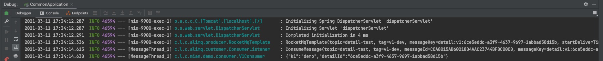

###  1. 组件
|  组件   | 版本  | 说明  |
|  ----  | ----  | ----  |
| spring-boot  | 2.2.5.RELEASE |   |
| fastjson  | 1.2.60 |   |
| ons-client  | 1.8.0.Final | 阿里云RocketMQ |

###  2. 需求
- 基于注解，集成阿里云 [RocketMQ](https://help.aliyun.com/product/29530.html?spm=a2c4g.11174283.6.540.6d6e57937NvtK2 ) 进行组件封装具备消息发送与消费能力
- 目前主要集成了 "普通消息"，"顺序消息"
- "事务消息" 待集成 


###  3. 配置
```
## 阿里云mq配置
aliyun.mq.address=http://onsaddr.mq-internet-access.mq-internet.aliyuncs.com:80
aliyun.mq.accessKey=阿里云accessKey
aliyun.mq.secretKey=阿里云secretKey
## 环境区分标示
aliyun.mq.suffix=-dev
## 打印日志，生产环境建议关闭
aliyun.mq.showLog=true

## 是否开启"顺序消息"生产者
aliyun.mq.producer.orderEnabled=false
## 是否开启消费者
aliyun.mq.consumer.enabled=true
```


###  4. 运行效果
- 测试代码见：com.leo.commons.mian.demo


